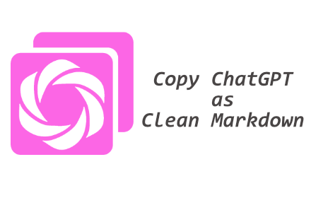

# ChaCopy

ChatGPT の各メッセージにワンボタンを追加し、メッセージを**整形された Markdown 形式**でクリップボードにコピーする Chrome 拡張機能。
<p align="center">
  
</p>

---

## 機能

### ワンクリック Markdown コピー

ChatGPT メッセージの下にボタンが表示される。クリックするとそのメッセージを Markdown に変換してクリップボードへコピーする。

### 数式の変換

ChatGPT の KaTeX 表示を Markdown/LaTeX 互換の形式に変換する。

| ChatGPT 表示 | 出力 |
|---|---|
| インライン数式 `\( ... \)` | `$...$` |
| ブロック数式 `\[ ... \]` | `$$...$$` |

### 太字の正規化

日本語で `**` がそのまま表示され、太字が認識されない問題を自動修正する。

変換前: これは**「太字」**です。

変換後: これは **「太字」** です。

コードブロック・インラインコード・数式の内部は変換しない。

### テーブル変換

HTML テーブルを GFM（GitHub Flavored Markdown）形式に変換する。

```markdown
| 列A | 列B |
| --- | --- |
| 1   | 2   |
```

---

## インストール

### 1. ビルド

```bash
npm install
npm run build
```

`dist/` ディレクトリが生成される。

### 2. Chrome に読み込む

1. Chrome で `chrome://extensions` を開く
2. 右上の「デベロッパーモード」をオンにする
3. 「パッケージ化されていない拡張機能を読み込む」をクリック
4. `dist/` ディレクトリを選択する

---

## 開発

### コマンド

| コマンド | 内容 |
|---|---|
| `npm run dev` | ウォッチモードでビルド（`dist/` に出力） |
| `npm run build` | プロダクションビルド |
| `npm test` | テストを実行 |
| `npm run test:watch` | ウォッチモードでテストを実行 |

### 変換パイプライン

```
ChatGPT DOM
   ↓ preprocessor   KaTeX 抽出・UI クローム除去
擬似 HTML
   ↓ Turndown       HTML → Markdown 変換（GFM 対応）
生 Markdown
   ↓ postprocessor  太字正規化
整形済み Markdown
```

### ディレクトリ構成

```
ChaCopy/
├── manifest.json
├── package.json
├── _locales/
├── chacopy/
├── img/
├── src/
│   ├── converter/
│   └── ui/
└── tests/
    └── res/
```

### 技術スタック

- **言語**: TypeScript
- **ビルド**: Vite + [@crxjs/vite-plugin](https://crxjs.dev/vite-plugin)
- **HTML→Markdown 変換**: [Turndown](https://github.com/mixmark-io/turndown) + [turndown-plugin-gfm](https://github.com/mixmark-io/turndown-plugin-gfm)
- **テスト**: Vitest + jsdom
- **拡張方式**: Chrome Extension Manifest V3

---

## 対象サイト

- `https://chatgpt.com/*`
- `https://chat.openai.com/*`
